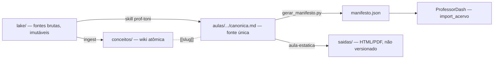

# Contexto do Projeto
_Última atualização: 2026-09-28_

## Objetivo e escopo
Acervo de conhecimento do Prof. Toni Coimbra para o Curso Técnico em Desenvolvimento de Sistemas (SEED-PR).
Faz duas coisas:
- **Segundo cérebro:** wiki de conceitos no modelo llm-wiki do Karpathy, mantida por LLM e navegável no Obsidian.
- **Warehouse de aulas:** Aulas Canônicas (`canonica.md`) neutras de plataforma, que o ProfessorDash importa e
  que as skills convertem em apostila HTML/PDF.

Fora do escopo: o portal ProfessorDash (repo próprio, Django); o setup do agente Quíron (`hermes-toni/`, fora
deste repo); o repo legado `elvertoni/ProfToniCoimbra` (só referência histórica da grade de disciplinas).

## Arquitetura
Pipeline em 4 camadas, cada uma com dono e regra de escrita (detalhe em `docs/schema-wiki.md` §1):



| Camada | Caminho | Papel |
|---|---|---|
| Lake | `lake/{disciplina}/` | Fontes brutas imutáveis (`status: bruto`) |
| Conceitos | `conceitos/{disciplina}/{slug}.md` | Nós atômicos da wiki; LLM escreve, Toni aprova fusão/obsolescência |
| Aulas | `aulas/{disciplina}/{trilha}/{NN-slug}/canonica.md` | Aula canônica — **fonte única de verdade** |
| Saídas | `aulas/**/{NN-slug}/saidas/` | Artefatos gerados (HTML, PDF) — não versionados, sempre regeneráveis |

Proveniência tem três papéis: arquivos brutos em `lake/` são a fonte e continuam imutáveis;
`lake/**/graphify-out/` é cache derivado de extração do Graphify, que ajuda a recuperar ou auditar texto mas
nunca substitui a fonte bruta ausente; `conceitos/`, `aulas/`, `tools/` e `docs/` são conteúdo versionado. Quando
a fonte bruta falta mas existe cache, manter a lacuna de proveniência explícita.

## Mapa do código
| Caminho | Responsabilidade |
|---|---|
| `lake/` | Fontes brutas (transcrições, PDFs, dumps do Notion, export RCO da SEED). Binários pesados são gitignored |
| `conceitos/` | Wiki de conceitos; `index.md` (catálogo regenerável) e `log.md` (diário append-only) |
| `aulas/` | Aulas canônicas por disciplina/trilha; pasta de aula = `canonica.md`, `imagens.md`, `capa.png`, `img/`, `fontes/` |
| `mapas/` | Navegação do Obsidian: MOCs gerados (`index.md` + um por disciplina) e vistas `.base` escritas à mão |
| `manifesto.json` | Índice máquina do acervo, gerado — contrato de import do portal |
| `tools/gerar_manifesto.py` | Gera e valida o `manifesto.json` |
| `tools/wiki_core.py` | Parser stdlib do subconjunto YAML do vault; usado por `lint_wiki.py` e `gerar_indice.py` |
| `tools/lint_wiki.py` · `tools/gerar_indice.py` · `tools/gerar_mapas.py` | Lint da wiki (somente leitura), catálogo e MOCs |
| `tools/extrair_rco.py` · `tools/triar_rco.py` · `tools/jev.py` | Intake das aulas RCO da SEED e triagem com o Jev |
| `tools/sync_notion.py` | Espelha o índice de aulas na base "Aulas" do Notion (mão única repo → Notion) |
| `tools/notion-wiki/` | Puxa páginas do Notion para o lake |
| `tools/transcrever/` | Transcrição local (faster-whisper, GPU com fallback CPU) para o lake |
| `tools/imagen-generator/` | **Não é script:** `prompt.xml` v6 (fonte de verdade visual) + logo + guia |
| `tests/` | `unittest` stdlib (36 testes em 2026-09-28) |
| `docs/` | `schema-wiki.md` (schema da wiki), manutenção da wiki, backlog de proveniência, triagem RCO |
| `.claude/skills/` | `prof-toni`, `aula-estatica`, `gerar-imagem-aula` |
| `hermes/skills/prof-toni/` | Skills do Quíron (`operar-acervo`, `alimentar-cerebro`), implantadas na VPS por `git pull` + cópia |

Gitignored por decisão: `**/saidas/`, `aulas/**/atividades/*.pdf` (o `.html` é a fonte editável),
`lake/**/elite-wiki/`, uma lista explícita de extensões pesadas do `lake/` (vídeo, áudio, PDF, Office, imagens —
formato novo não fica coberto até entrar no `.gitignore`), `graphify-out/`, `scratch/`, `.playwright-mcp/`,
`.obsidian/`, `codex-session-*.md`, `.ai/handoff.md` e `.ai/sessions/`. Uma disciplina do `lake/` que parece
vazia no git costuma ter PDFs só locais — conferir o disco antes de concluir que não há material.

## Integrações externas
- **ProfessorDash** — portal das aulas; `import_acervo` baixa o tarball do GitHub e lê `manifesto.json` +
  `aulas/**/canonica.md`. Contrato completo em `docs/schema-wiki.md` §5.1. Publicação em 4 passos (invariante 6
  do `AGENTS.md`).
- **Notion ("Toni's Brain")** — `sync_notion.py` projeta o índice de aulas (metadados + link do ProfessorDash,
  sem corpo) na base `Aulas`, com chave na propriedade `Caminho`. Mão única: o Notion nunca é entrada. Escrita
  só com `--apply`. As bases `Aulas` e `Projetos` precisam estar compartilhadas com a integração.
- **Jev (TypeSafe)** — modelo de julgamento: devolve respostas tipadas `noul`, `choice` ou `score` com
  probabilidade e nunca gera texto. Usado na triagem em massa em que o código decide; lê só texto, é mais forte
  em inglês. A triagem das 516 aulas RCO custou cerca de US$ 0,07. Respostas ficam em cache em `scratch/jev-rco/`.
- **Codex CLI** — gera as imagens de aula: o agente monta o prompt v6 resolvido, delega à ferramenta nativa de
  imagem do Codex e audita o PNG (verificado em 2026-07-29). O Projeto do ChatGPT no navegador é o caminho
  alternativo. Ler `.claude/skills/gerar-imagem-aula/SKILL.md` antes.
- **Photoshop** — action determinística aplica logo, identificação do curso e canvas canônico sobre a arte-base.
- **Quíron (Hermes Agent na VPS)** — opera o acervo a partir de um clone na VPS com as skills de `hermes/`.
- **ai-memory (MCP local)** — memória semântica complementar (decisão #001).
- **Obsidian** — a raiz é o vault; o plugin kepano `obsidian` (obsidian-bases, obsidian-markdown, json-canvas,
  obsidian-cli, defuddle) está habilitado no escopo do projeto em `.claude/settings.json`.

## Modelo de dados (resumo)
- **Aula** (`canonica.md`) → frontmatter do contrato (`titulo`, `disciplina`, `trilha`, `ordem`, `slug`,
  `status`, `versao`, `atualizado_em`) + campos da skill (`tema`, `serie`, `prerequisitos`, `objetivos`,
  `modo_origem`, `fontes`); cita conceitos por `[[slug]]`.
- **Conceito** (`conceitos/{disciplina}/{slug}.md`) → `conceito`, `slug`, `disciplina`, `tipo`
  (`conceito|entidade|sintese`), `aka`, `status` (`vivo|rascunho|obsoleto`), `fontes`, `aulas`,
  `atualizado_em`; lista as aulas que o citam em `## Onde aparece`.
- **Manifesto** → `disciplinas[]` (com `trilhas[]`), `lessons[]` (só `aprovada`) e `conceitos[]`
  (`{slug, nome, disciplina}` de todo nó não obsoleto — o portal troca `[[slug]]` pelo nome com acento por aí).
- **Nota RCO** (`lake/{disciplina}/rco/{n}tri/*.md`) → `tipo: rco-seed`, `status: bruto`, `fontes` apontando
  para os `.pptx`/`.docx` originais. É matéria-prima, não aula: virar `canonica.md` passa pela `prof-toni` em
  modo SEED.

### Vocabulário do corpo da canônica (catálogos fechados)
Especificado em `.claude/skills/prof-toni/spec/01-CANONICA.md` §5–§7; bloco inventado aparece como texto cru
para o aluno.
- **Callouts (6):** `:::conceito`, `:::exemplo`, `:::importante`, `:::atencao`, `:::dica`, `:::curiosidade`;
  abertos como `:::tipo Título`, fechados com `:::`.
- **`:::roteiro`:** direção de cena só do professor. A apostila sempre o omite — nunca pôr ali algo que o aluno
  precise.
- **Interativos (2):** ` ```quiz ` e ` ```diagrama-progressivo `. O corpo é YAML real: valor com `: ` ou que
  começa com aspas vai entre aspas duplas. Cada pergunta tem exatamente uma alternativa `correta: true` (duas
  viram duas certas; nenhuma degrada a lista). `rotulo` de diagrama não leva número próprio ("1 · 1. Navegador").
- O `feedback` do quiz não é renderizado hoje; continuar escrevendo, mas nunca ensinar por ele.
- Uso em 2026-09-21: 80 quizzes e 73 diagramas progressivos nas 89 aulas.

### Comportamento do gerador do manifesto (`tools/gerar_manifesto.py`)
- A identidade vem do **caminho**; o frontmatter é validado contra ele. Divergência é reportada, nunca
  corrigida em silêncio.
- `slug` precisa ser único **em todo o vault**, mas o gerador só impõe isso entre aulas aprovadas
  (`vistos_slug` em `coletar()`): colisão com rascunho ou com nó de `conceitos/` passa no `--check` e quebra
  a resolução de wikilink.
- O parser de frontmatter é mínimo de propósito: só chaves escalares de topo; campos do contrato ficam planos.
- O gerador parte do `manifesto.json` existente: `version`, `vault`, `descricao`, `arquitetura`, `series[]` e
  `serie`/`status`/`lake`/`warehouse` de cada disciplina vêm do arquivo, e `disciplinas[]` só emite slugs que já
  estão lá. Disciplina nova gera aulas em `lessons[]` sem entrada em `disciplinas[]` até alguém semear os
  metadados — a única exceção ao "nunca editar à mão".
- Rótulos de exibição ficam em `LABELS_DISCIPLINA` / `LABELS_TRILHA` no próprio gerador; registrar ali ao criar
  disciplina ou trilha.
- `sync_notion.py` importa `parse_frontmatter` do gerador: mudar esse parser afeta os dois.

Validadores: `gerar_manifesto.py --check`, `lint_wiki.py` e `sync_notion.py --check`. Frescor de derivados:
`gerar_indice.py --check`, `gerar_mapas.py --check`, `extrair_rco.py --check`.

## Estado atual do vault
Snapshot de 2026-09-21; `gerar_manifesto.py --check` confirmou **89 aulas aprovadas, 0 divergências** em
2026-09-28. O manifesto e o `--check` mandam — revalidar antes de confiar nos números.

| Disciplina | Trilha | Estado |
|---|---|---|
| `inteligencia-artificial` | `fundamentos-de-ia` | aulas 1–25 aprovadas (25) + grafo de 37 conceitos |
| `introducao-a-computacao` | `arquitetura-computadores-e-sistemas-operacionais` | aulas 23–38 aprovadas (16) |
| `programacao-front-end` | `landing-page-mvp` | aulas 7–18 aprovadas (12) — startup/MVP até publicar e validar; 12 infográficos em `img/` |
| `analise-e-metodos-para-sistemas` | `metodologias-ageis` | aulas 33–41 + 53–54 aprovadas (11) (Scrum/agilidade, Kanban) |
| `tcc` | `blueprint-tcc` | aulas 1–9 aprovadas (9) |
| `analise-e-projeto-de-sistemas` | `marketing-digital` | aulas 25–30 aprovadas (6) |
| `programacao-front-end` | `controle-de-versao-git-github` | aulas 2–6 aprovadas (5) + `atividades/` (apoio impresso, fora do manifesto) |
| `introducao-a-computacao` | `nivelamento-e-retomada` | aulas 1–2 aprovadas (2) |
| `analise-e-projeto-de-sistemas` | `analise-de-requisitos` | aula 31 aprovada (1) |
| `programacao-front-end` | `fundamentos-html-css` | aula 1 aprovada (1) |
| `programacao-no-desenvolvimento-de-sistemas` | `arquitetura-e-fluxo-de-sistemas` | aula 1 aprovada (1) |
| `programacao-front-end` | `projeto petfinder` | **só HTML** (9 arquivos), sem `canonica.md` — não importável |
| `programacao-no-desenvolvimento-de-sistemas` | `blueprint-tcc` | HTML de apoio; as canônicas vivem em `tcc/blueprint-tcc` |
| `inovacao-tecnologia-e-empreendedorismo` | — | sem aulas canônicas |

A wiki tem cerca de 1.042 nós ativos, concentrados nas ingestões das duas pós-graduações
(`inovacao-inteligencia-artificial-e-robotica-educacional` e `desenvolvimento-full-stack-e-cloud-computing`) e
nos grafos menores por disciplina. A maioria está `status: rascunho`. As aulas aprovadas usam um subconjunto
pequeno; `lint_wiki.py` mostra cobertura e backlinks faltando.

## Variáveis de ambiente relevantes
- `NOTION_TOKEN` — token da integração interna do Notion usada por `sync_notion.py` (valores reais nunca aqui)
- `TYPESAFE_API_KEY` — chave do Jev usada por `triar_rco.py`

## Pontos de atenção / dívida técnica
- Não há CI (`.github/` não existe): testes e validadores só rodam quando alguém roda.
- Cerca de 186 camadas de diagrama em aulas aprovadas têm numeração manual no `rotulo`, contra o contrato — não
  copiar aula existente como referência de diagrama.
- Lint em 2026-09-28: 0 erros, 1.452 avisos (1.264 `source-missing`, 189 `orphan`) e 538 infos — a maior parte é
  fonte bruta que só existe em outra máquina ou virou cache.
- A triagem RCO (`docs/rco-triagem.md`) é auxílio de ordenação: pares errados voltaram com confiança de 0,88 a
  0,96. Equivalência abaixo de 0,7 vem marcada com ⚠.
- `lake/**/elite-wiki/` não vem no clone; recriar com `python tools/notion-wiki/puxar_notion.py`.
- Exports de conversa do Codex (`codex-session-*.md`, cerca de 9,7 MB) ficam na raiz, gitignored.
- A memória antiga do ai-memory (`_rules/git-ssh-duas-contas.md`) diz que o repo é privado; o `gh` informa
  **público** em 2026-09-28.
- Memória legada congelada em `~/.claude/projects/C--PROJETOS-PROF-TONI/memory/` (só histórico).
