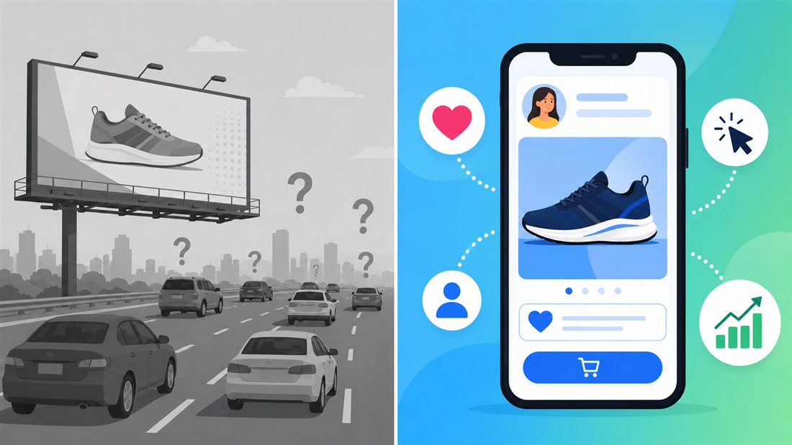

Abre o seu feed agora. Entre um vídeo e outro apareceu um tênis que você comentou ontem, um criador que você segue divulgando um curso, um anúncio de uma loja que você nunca procurou mas que parece saber exatamente o que você quer. Nada disso é coincidência. Você está dentro de uma máquina que custou décadas para ser construída e que tem um nome: **marketing digital**. A aula de hoje vira essa máquina do avesso — você vai sair dela entendendo, do outro lado da tela, como marcas decidem o que te mostrar, por que conseguem medir cada clique seu e o que isso tem a ver com os sistemas que você vai construir como profissional.

## Objetivos

Ao final desta aula, você será capaz de:

- Explicar **o que é** marketing digital e em que ele se diferencia do marketing tradicional.
- Identificar os **três diferenciais** que tornaram o digital dominante: alcance com segmentação, interatividade e mensurabilidade.
- Reconhecer as principais **técnicas** (SEO, SEM, marketing de conteúdo, redes sociais) e os **canais** por onde o público chega.

## Pré-requisitos

Nenhum. Basta ser usuário de internet — e isso você já é o dia inteiro.

## Desenvolvimento

### Do outdoor para o feed: o que mudou

Marketing sempre existiu: é o conjunto de ações para fazer um produto ou serviço chegar a quem possa querer comprá-lo. O que mudou foi o **lugar** e, com ele, as **regras do jogo**.

:::conceito Marketing digital
Uso de plataformas e tecnologias **online** — sites, redes sociais, e-mails, buscadores e anúncios pagos — para promover produtos e serviços. A diferença não é só "ser na internet": é poder **interagir diretamente** com cada pessoa e **medir** cada resultado em tempo real.
:::

Pensa num outdoor na beira da rodovia. Ele é visto por milhares de carros por dia — mas a empresa não tem ideia de **quem** olhou, se a pessoa se interessou, nem se ela comprou por causa dele. O dono do outdoor está, literalmente, falando para uma multidão no escuro. Agora pensa num anúncio no Instagram: a marca sabe sua idade aproximada, sua cidade, o que você curte, quantos segundos você assistiu, se clicou, e se terminou comprando. É a diferença entre gritar numa praça e conversar no pé do ouvido de cada um.



:::atencao Erro comum
"Marketing digital é postar bastante nas redes sociais." Não é. Estar presente é só a porta de entrada. Marketing digital é ter **estratégia** (o que postar, para quem, com qual objetivo) e, principalmente, **medir** se aquilo funcionou. Uma marca que posta todo dia mas nunca olha os números está fazendo barulho, não marketing.
:::

### Os três superpoderes do digital

O que faz o digital ganhar do tradicional cabe em três palavras.

| Diferencial | Marketing tradicional | Marketing digital |
|---|---|---|
| **Alcance e segmentação** | Amplo, mas no escuro: TV, outdoor, rádio falam para todo mundo | Global e **mirado**: escolhe idade, local, interesses, comportamento |
| **Interatividade** | Mão única — a marca fala, você só escuta | Mão dupla — você comenta, compartilha, responde na hora |
| **Mensurabilidade** | Difícil e lento: "vendeu mais, mas não sei por quê" | Imediata: cliques, conversões e engajamento em tempo real |

:::importante O diferencial que manda em todos
Dos três, a **mensurabilidade** é o que muda o jogo de verdade. Quando você consegue medir cada passo, você pode **ajustar no meio do caminho**: trocar o anúncio que não converte, investir mais no que está dando certo, parar de gastar com o que não funciona. O marketing tradicional só descobre o resultado no fim do mês; o digital corrige a rota durante a corrida.
:::

### As ferramentas do jogo

Quatro técnicas aparecem o tempo todo daqui pra frente. Duas delas são o tema das duas próximas aulas, então guarde os nomes.

:::conceito SEO e SEM
**SEO** (*Search Engine Optimization*) é otimizar seu conteúdo para aparecer **de graça** no topo dos resultados de busca — o chamado tráfego orgânico. **SEM** (*Search Engine Marketing*) é **pagar** para aparecer ali. Em resumo: SEO você conquista, SEM você compra. (Aulas 26 e 27 abrem cada um deles.)
:::

:::conceito Marketing de conteúdo
Criar e compartilhar material útil — posts, vídeos, e-books, infográficos — para **atrair** o público pelo valor, em vez de empurrar propaganda. Em vez de gritar "compre meu tênis", a marca ensina "como escolher o tênis certo para corrida". Quem ajuda, ganha confiança; quem ganha confiança, vende.
:::

As **redes sociais** (Instagram, TikTok, YouTube, LinkedIn) são onde tudo isso ganha alcance viral e feedback direto, e os **canais digitais** são os caminhos por onde o público chega até a marca. É essa jornada que o diagrama abaixo destrincha.

```diagrama-progressivo
titulo: Como uma pessoa vira cliente de uma loja online
camadas:
  - rotulo: 1. Descoberta
    conteudo: A pessoa busca "tênis de corrida barato" no Google e encontra um artigo da loja bem posicionado (SEO) — ou vê um anúncio pago (SEM). Primeiro contato feito.
  - rotulo: 2. Interesse
    conteudo: Ela entra no site e no Instagram da marca, lê um conteúdo que ajuda de verdade e começa a confiar. O marketing de conteúdo fez o trabalho.
  - rotulo: 3. Relacionamento
    conteudo: Ela segue a marca e deixa o e-mail em troca de um cupom. Agora a loja pode falar direto com ela por e-mail, sem depender do algoritmo.
  - rotulo: 4. Conversão
    conteudo: Recebe uma oferta no momento certo e compra. A loja registra exatamente de qual canal veio essa venda — e investe mais nele.
```

## Prática

**Atividade "engenharia reversa de marca" (em duplas, sem computador obrigatório, ~15 min).** Cada dupla escolhe **uma marca ou criador que vocês realmente seguem** (uma loja, um youtuber, um app). No caderno, respondam:

1. **Canais** — em quais lugares essa marca aparece para vocês? (feed, stories, busca do Google, e-mail, anúncio…)
2. **Técnica** — o que ela faz para atrair: posta conteúdo útil? aparece em anúncio pago? sai no topo da busca?
3. **Mensurabilidade** — que sinais públicos mostram se está funcionando? (curtidas, comentários, número de seguidores, avaliações)
4. **Veredito** — na opinião de vocês, ela usa bem os três superpoderes do digital? O que melhoraria?

Ao final, cada dupla apresenta sua marca em 1 minuto. A turma compara: quais marcas dependem de conteúdo, quais dependem de anúncio pago?

:::dica Por que isto importa para quem desenvolve sistemas
Você está num curso técnico, não numa agência de publicidade — então por que estudar isso? Porque o **sistema que você vai construir** (um e-commerce, um app, uma landing page) precisa ser *marketing-ready*: ter SEO para o Google achar, integrar uma ferramenta de análise (como o Google Analytics) para medir os acessos, e gerar os dados que o time de marketing vai usar para decidir. Programador que entende mensurabilidade constrói telas que registram os eventos certos. Quem não entende, entrega um site bonito que ninguém consegue medir.
:::

## Avaliação

```quiz
- pergunta: Qual é a principal vantagem do marketing digital sobre o tradicional?
  alternativas:
    - texto: Ele é sempre mais barato que qualquer anúncio na TV
    - texto: Ele permite segmentar o público e medir cada resultado em tempo real
      correta: true
    - texto: Ele dispensa qualquer tipo de estratégia ou planejamento
    - texto: Ele alcança um público mais amplo e genérico
  feedback: >
    O ganho central não é preço nem alcance bruto — é poder mirar quem você quer
    e medir o que acontece, ajustando a campanha enquanto ela roda.
- pergunta: Uma loja posta todo dia no Instagram, mas nunca olha curtidas, cliques ou vendas. Por que isso ainda não é marketing digital de verdade?
  alternativas:
    - texto: Porque marketing digital só vale em anúncios pagos
    - texto: Porque falta a mensurabilidade — sem medir, não dá para saber o que funciona nem ajustar
      correta: true
    - texto: Porque o Instagram não serve para marketing
    - texto: Porque postar todo dia é exagero
  feedback: >
    Presença sem medição é barulho. O que separa marketing de "só postar" é usar
    os números para decidir o próximo passo.
- pergunta: Qual a diferença entre SEO e SEM?
  alternativas:
    - texto: SEO é pago e SEM é gratuito
    - texto: SEO é aparecer de graça na busca (orgânico); SEM é pagar para aparecer
      correta: true
    - texto: São dois nomes para a mesma coisa
    - texto: SEO é para redes sociais e SEM é para e-mail
  feedback: >
    SEO você conquista com conteúdo otimizado; SEM você compra com anúncios. Os dois
    miram o mesmo lugar — o topo dos resultados de busca.
```

## Fechamento

Hoje você descobriu que:

- **Marketing digital** não é "estar na internet": é interagir direto com cada pessoa e **medir** cada resultado.
- O digital vence o tradicional por três superpoderes — **alcance com segmentação, interatividade e mensurabilidade** — e a mensurabilidade é a que manda em todas.
- As técnicas centrais são **SEO, SEM, marketing de conteúdo e redes sociais**, e o público chega por **canais** numa jornada de descoberta até a compra.
- Quem **desenvolve sistemas** precisa construir produtos *marketing-ready*: mensuráveis, achaveis e integrados a ferramentas de análise.

**Próxima aula:** vimos que dá para aparecer na busca **de graça**. Mas como, exatamente? Na Aula 26 a gente abre o **tráfego orgânico** — atrair visitantes sem pagar por anúncio.

:::roteiro
Abrir mandando todo mundo literalmente puxar o celular e olhar o último anúncio que apareceu no feed — o impacto vem de eles perceberem que JÁ estão dentro do tema. Não definir marketing digital de cara: deixe-os tentarem ("o que vocês acham que é?") e construa a definição em cima das respostas. O erro comum ("é só postar") quase sempre aparece sozinho na fala da turma — use isso. Na tabela dos três superpoderes, peça exemplos deles (um anúncio que os "perseguiu" = segmentação). A prática de engenharia reversa funciona melhor se você sortear 3-4 duplas para apresentar, não todas — guarde uns 8 min finais para o quiz coletivo lendo o feedback em voz alta. A atividade da Alura (curso "Marketing Digital - explorando conceitos") fica como extensão extraclasse opcional, não cobre em aula.
:::
